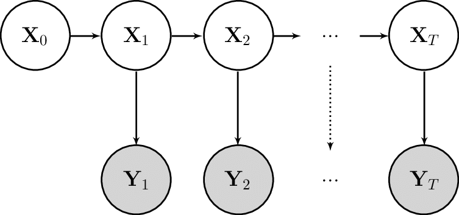

# SSMProblems

## Installation

In the `julia` REPL:

```julia
] add SSMProblems
```

## Documentation

`SSMProblems` defines a generic interface for State Space Models (SSM). The main objective is to provide a consistent
interface to work with SSMs and their log-densities.

Consider a Markovian model from[^Murray]:


[^Murray]:
    > Murray, Lawrence & Lee, Anthony & Jacob, Pierre. (2013). Rethinking resampling in the particle filter on graphics processing units.

The model is fully specified by the following densities:

- __Initialisation__: ``f_0(x)``
- __Transition__: ``f(x)``
- __Emission__: ``g(x)``

The dynamics of the model are reduced to:

```math
\begin{aligned}
x_t | x_{t-1} &\sim f(x_t | x_{t-1}) \\
y_t | x_t &\sim g(y_t | x_{t})
\end{aligned}
```

assuming ``x_0 \sim f_0(x)``.

The joint law follows:

```math
p(x_{0:T}, y_{0:T}) = f_0(x_0) \prod_t g(y_t | x_t) f(x_t | x_{t-1})
```

Users can define their SSM with `SSMProblems` in the following way:

```julia
struct Model <: AbstractStateSpaceModel end

# Sample from the initial density
function transition!!(rng::AbstractRNG, model::LinearSSM)
    return rand(rng, f0(model))
end

# Sample from the transition density
function transition!!(rng::AbstractRNG, model::LinearSSM, state::Float64, ::Int)
    return rand(rng, f(state, model))
end

# Return log-density of the model at *time* `step`
function emission_logdensity(model::LinearSSM, state::Float64, observation::Float64, ::Int) 
    return logpdf(g(state, model), observation)
end

# Optionally, if the transition log-density is known, the model can also specify it
function transition_logdensity(model::LinearSSM, prev_state::Float64, current_state::Float64, ::Int)
    return logpdf(f(prev_state, model), current_state)
end
```

Note, the omitted integer parameters represent the time step `t` of the state. Since the model is time-homogeneous, these are not required in the function bodies.

Package users can then consume the model `logdensity` through calls to `emission_logdensity`.

For example, a bootstrap filter targeting the filtering distribution ``p(x_t | y_{0:t})`` using `N` particles would roughly follow:

```julia
struct Particle{T<:AbstractStateSpaceModel} <: AbstractParticle{T} end 

for (timestep, observation) in enumerate(observations)
    idx = resample(rng, logweights)
    particles = particles[idx]
    for i in 1:N
        latent_state = transition!!(rng, model, particles[i].state, timestep)
        particles[i] = SSMProblems.Utils.Particle(particles[i], latent_state)  # track parent
        logweights[i] += emission_logdensity(model, particles[i].state, observation, timestep)
    end
end
```

### Interface
```@autodocs
Modules = [SSMProblems, SSMProblems.Utils]
Order   = [:type, :function, :module]
```
